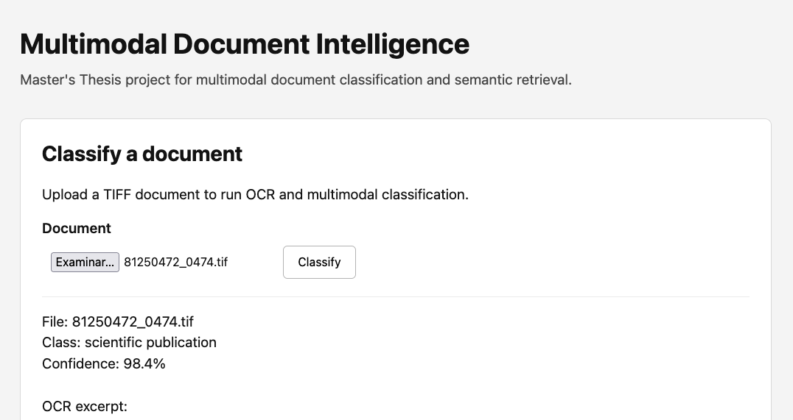
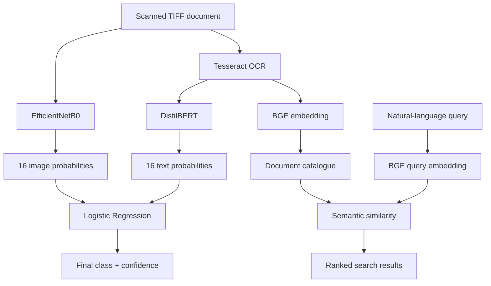

# Multimodal Document Intelligence

**Multimodal document classification and semantic retrieval using NLP, computer vision and late fusion.**

This project started from a simple question: a document contains both textual information and visual structure, so can those two sources of information complement each other when classifying it?

To explore that idea, I developed a system that combines OCR, **DistilBERT** and **EfficientNetB0** to classify scanned documents into the 16 categories of the RVL-CDIP dataset. The probability outputs of both models are combined through a **Logistic Regression late-fusion model**, while a separate **BGE embedding model** provides semantic document retrieval through natural-language queries.

The result is a functional application where a document can be uploaded, processed, classified, added to a searchable catalogue and later retrieved from the browser.

> **Master's Thesis Project — Artificial Intelligence, 2026**<br>
> This repository is the maintained engineering version of my Master's Thesis, originally written and presented in Spanish.



## What the project does

The system brings two functions together in a single document workflow:

1. **Multimodal classification** — a scanned TIFF document is processed with OCR and classified independently from its text and image content. A final Logistic Regression model combines the 16 probabilities from DistilBERT with the 16 probabilities from EfficientNetB0 and produces the final class prediction.
2. **Semantic retrieval** — OCR text is encoded with `BAAI/bge-small-en-v1.5`, allowing documents to be retrieved through natural-language queries rather than filenames or exact keyword matches.

When a new document is uploaded through the application, it is classified, embedded and incorporated into the same catalogue used by the retrieval system.

## Example output

A successful classification returns the uploaded filename, the final predicted class, confidence and an OCR excerpt.

```text
File: 81250472_0474.tif
Class: scientific publication
Confidence: 98.4%
```

The same web interface also provides semantic search and class-based filtering over the document catalogue.

OCR output can contain noise, which is expected for scanned historical documents and is one of the practical limitations considered throughout the project.

## Architecture



The classification and retrieval pipelines are exposed through a **FastAPI** application and packaged in **Docker**.

The maintained application can work with local model artifacts and storage. The original thesis deployment used AWS as the cloud backend.

## Results

The final multimodal classifier was evaluated on the held-out RVL-CDIP test partition after model and fusion selection had been completed.

| Metric | Final result |
| --- | ---: |
| Macro-F1 | **0.9165** |
| Accuracy | **0.9166** |
| Valid test documents | **38,520** |
| Classes | **16** |

The result also confirmed the main idea behind the project: the visual branch does not need to outperform the text model independently to be useful. DistilBERT and EfficientNetB0 make different errors, and combining their probability distributions allows the fusion model to correct part of them.

## Dataset and training

The classification models were developed using **RVL-CDIP**, together with OCR transcriptions used by the text branch.

After filtering documents without usable OCR text, the full AWS experiments used:

| Partition | Valid documents |
| --- | ---: |
| Train | 308,026 |
| Validation | 38,498 |
| Test | 38,520 |
| **Total** | **385,044** |

DistilBERT and EfficientNetB0 were fine-tuned independently. Their outputs were then compared using several late-fusion strategies before Logistic Regression was selected for the final multimodal model.

The test set was kept separate from model selection and final fusion training and was used only for the final evaluation.

## Semantic retrieval

Classification answers *what type of document is this?* Semantic retrieval addresses a different problem: *which documents are related to what I am looking for?*

The retrieval component uses `BAAI/bge-small-en-v1.5` to transform OCR text and search queries into normalized embeddings. Documents can then be ranked according to semantic similarity even when the query does not contain exactly the same words as the document.

The initial semantic catalogue developed for the thesis contains **3,200 documents**. Uploaded documents can be embedded and appended to that catalogue through the application.

## Requirements

The recommended way to run the project is through Docker.

You need:

- **Git**
- **Docker Desktop** or another compatible Docker runtime
- the trained model artifacts and semantic catalogue described below
- an internet connection when building the image for the first time

Tesseract OCR and the Python runtime dependencies are installed inside the Docker image, so they do not need to be configured separately on the host system.

The main runtime components are:

- Python 3.11
- PyTorch and Hugging Face Transformers for DistilBERT
- TensorFlow / Keras for EfficientNetB0
- scikit-learn and Joblib for late fusion
- Sentence Transformers for BGE embeddings
- Tesseract OCR and Pillow for document processing
- pandas and PyArrow for the semantic catalogue
- FastAPI and Uvicorn for the web application
- boto3 for the optional S3-backed mode

Exact Python package versions are pinned in [`requirements.txt`](requirements.txt).

## Data and inference assumptions

The application intentionally keeps trained artifacts and runtime data outside Git history.

For local execution, it expects:

```text
data/
├── text_model/
├── image_model/
│   └── model.keras
├── fusion_logreg.joblib
├── class_order.json
└── documents.parquet
```

Several contracts must remain unchanged because the inference pipeline is intended to reproduce the preprocessing used during evaluation:

- input documents are currently expected as `.tif` or `.tiff` images;
- OCR is performed in English;
- DistilBERT input is truncated to a maximum of 512 tokens;
- EfficientNetB0 receives RGB images resized to `384 × 384`;
- late fusion receives **32 features in a fixed order**: the 16 text probabilities followed by the 16 image probabilities;
- class order is loaded from `class_order.json` and must match the order used during training;
- the semantic-search catalogue is stored in `documents.parquet` and must preserve row-to-embedding alignment.

These are implementation contracts rather than configurable defaults: changing them would require validating the models again.

Large model files and generated data are excluded through `.gitignore`.

Public distribution of the trained models and derived catalogue is being handled separately so that model and dataset licensing and provenance can be checked before those artifacts are published.

## Installation

Clone the repository:

```bash
git clone https://github.com/gonzalobosque/multimodal-document-intelligence.git
cd multimodal-document-intelligence
```

Place the required trained artifacts under `data/` using the structure shown above.

No manual Python environment is required for the Docker workflow.

## How to run it

Build the Docker image:

```bash
docker build -t multimodal-document-intelligence:local .
```

Run the application with the local artifact directory mounted into the container:

```bash
docker run --rm \
  --name mdi-local \
  -p 8080:8080 \
  -v "$(pwd)/data:/app/data" \
  -e ARTIFACT_SOURCE=local \
  multimodal-document-intelligence:local
```

Then open:

```text
http://localhost:8080
```

The health endpoint is available at:

```text
http://localhost:8080/health
```

A successful response is:

```json
{"status":"ok"}
```

## Configuration

Safe configuration examples are included in [`.env.example`](.env.example).

The application supports two artifact modes:

- `ARTIFACT_SOURCE=local` — models, catalogue and uploaded documents are stored locally;
- `ARTIFACT_SOURCE=s3` — artifacts are loaded from S3 and application data can be synchronized with AWS.

The local mode is the currently validated reference path for this maintained repository. The original thesis AWS deployment was validated end to end, while the refactored S3 mode will be revalidated separately before being documented as the current deployment procedure.

## AWS deployment

A major part of the original thesis was moving the prototype from the development environment to AWS and running the workflow on the full dataset.

The thesis architecture used:

| Service | Role in the project |
| --- | --- |
| **Amazon SageMaker** | Dataset preparation, model training and large-scale inference jobs |
| **Amazon S3** | Datasets, model artifacts, probability outputs and document catalogue |
| **Amazon CloudWatch** | Training and application logs |
| **Amazon ECR** | Docker image registry |
| **Amazon ECS / AWS Fargate** | Containerized FastAPI application |
| **AWS IAM** | Controlled access between AWS resources |

This architecture made it possible to preserve outputs from each stage as reusable artifacts instead of rebuilding the complete pipeline every time.

The original AWS deployment was validated end to end during the thesis. For this maintained repository, **local Docker execution is currently the reference runtime**. The S3-backed mode remains available in the application code and will be revalidated separately before being documented as the current AWS deployment path.

## Repository structure

Current application structure:

```text
multimodal-document-intelligence/
├── docs/
│   └── images/
│       └── app-example.png
├── src/
│   ├── config.py
│   ├── inference.py
│   ├── main.py
│   └── static/
│       ├── app.js
│       ├── index.html
│       └── style.css
├── Dockerfile
├── requirements.txt
├── .env.example
├── .dockerignore
├── .gitignore
└── README.md
```

Selected thesis documentation and notebooks will be incorporated separately from the application code.

## Limitations

This project should be interpreted according to the scope in which it was evaluated.

- Classification metrics correspond to **RVL-CDIP**. The models have not yet been systematically evaluated on documents from a different domain.
- Semantic retrieval was evaluated through **qualitative tests**, so similarity scores should not be interpreted as calibrated probabilities of relevance.
- OCR errors can propagate into both text classification and semantic retrieval.
- The current application is an **academic prototype**, not a production document-management platform.
- Public distribution of trained artifacts and derived data still requires a final review of their respective licences and provenance.

One of the most interesting next steps is therefore to evaluate the system on more recent, out-of-domain documents and determine which parts of the learned representations transfer successfully beyond RVL-CDIP.

## Project status

The Master's Thesis itself is complete. This repository continues the project as a maintained engineering version, with the objective of making the original work easier to reproduce, run and extend.

Current work focuses on:

- making the application independent from a permanent AWS deployment;
- preparing reproducible access to the trained model artifacts;
- adding the original experimental notebooks and thesis documentation;
- improving testing and deployment reproducibility;
- evaluating the system on documents outside the original training domain.

## Author

**Gonzalo Bosque Rodríguez**<br>
Master's Thesis in Artificial Intelligence, 2026.
